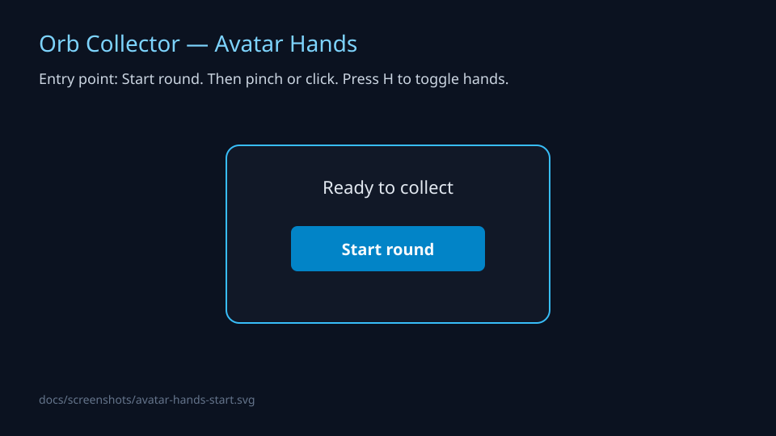
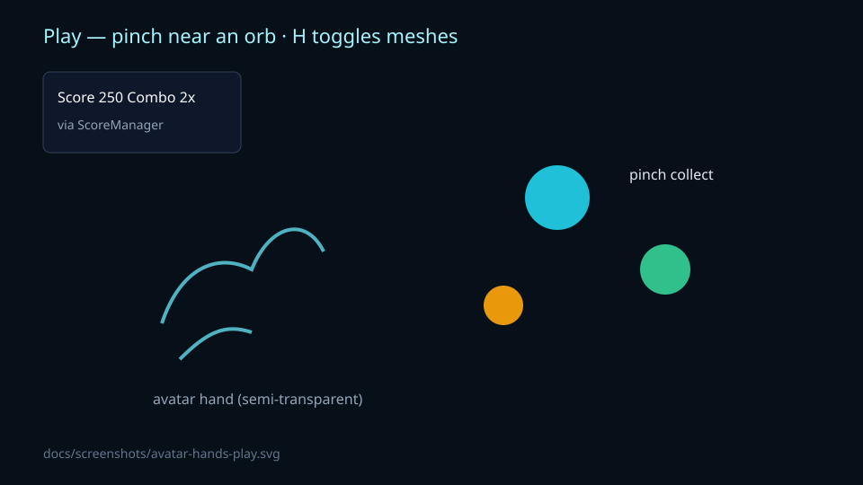

# VR — Orb Collector for Meta Quest

[](https://github.com/Bannon-github/vr/actions/workflows/ci.yml)
[](https://developers.meta.com/horizon/)
[](https://threejs.org/)

A 60-second **orb-collecting** game for the **Meta Quest** family. Play it in a desktop browser (ghost hands) or in **Quest Browser** with controllers and hand tracking.

This is a personal project by someone learning in public. The goal is a loop that is fun in a headset, then iterate toward the Meta Horizon Store — not a second renderer, not a Unity restart, not another import dump.

## Decision: WebXR is the product

The playable code is **WebXR + three.js**. Unity is later packaging, not the Quick Start.

| Do this | Don't do this |
|---|---|
| Run Orb Collector | Start a Unity project |
| Polish pinch / trigger / ghost-hands | Import another repo into `imports/` |
| Deploy HTTPS / GitHub Pages for Quest Browser | Build slot machines or 2D casino demos |
| Keep one collect pipeline | Add a second renderer (A-Frame + three.js) |

Playable app: [`imports/Me-google/platform/quest/game/`](imports/Me-google/platform/quest/game/)

## Quick start

You need Node 20+ (22 is what CI uses). A Quest headset is optional for the first hour.

```bash
git clone https://github.com/Bannon-github/vr.git
cd vr
npm install
npm test
npm run dev
```

Open the URL Vite prints (default `http://localhost:5173`).

1. Click **Start round**. Semi-transparent hands appear.
2. Move the pointer — the right hand follows. The left wrist shows live score.
3. Click orbs to collect. Chain grabs within 2 seconds for combo.
4. **Space** starts or pauses. **H** toggles hands.





### On a Quest (USB, no HTTPS fight)

Quest Browser only treats `https://` or `http://localhost` as a secure context. Self-signed LAN certs usually fail. Use `adb reverse` so the headset thinks it is localhost:

```bash
adb reverse tcp:5173 tcp:5173
```

Then in Quest Browser open `http://localhost:5173` → **Enter VR**.

| Action | Desktop | Controllers | Hand tracking |
|---|---|---|
| Collect | Click | Trigger | Pinch (thumb + index) |
| Pause | Space / overlay | Grip squeeze | Overlay / grip |
| Toggle hands | H | — | — |

## What's in the repo

```
vr/
├── README.md
├── FEATURES.md
├── .github/copilot-instructions.md
├── imports/Me-google/platform/quest/game/   # the product
├── imports/quest-vr-creator/                # vision notes
└── imports/WeMadeAGame/                     # reference only
```

`imports/` is a bootstrap snapshot from PR #1. Do not add to it. New work goes in the game folder.

## Project goals

**Now:** a stranger can play a full 60-second round on desktop and on Quest 3.

**Next:** GitHub Pages (HTTPS); wrist holographic tablet; promote the game to `/app`.

**Later:** Horizon Store. Monetization after it is fun, not before.

## License

MIT. See `MIGRATION_NOTES.md` for import attribution.
